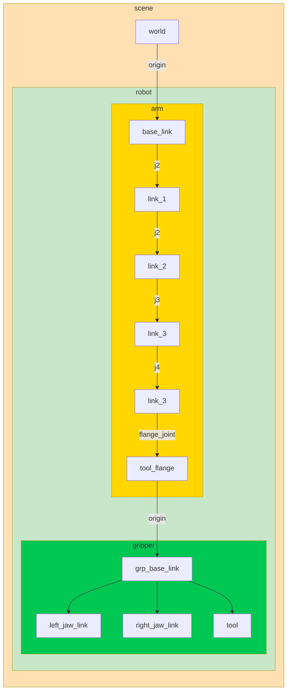
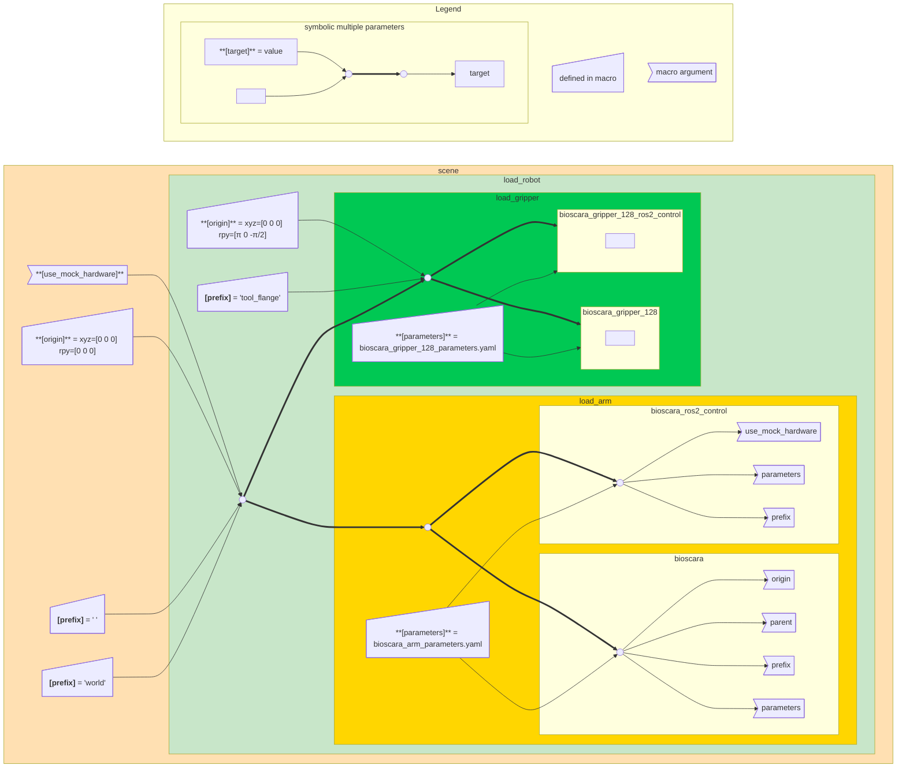
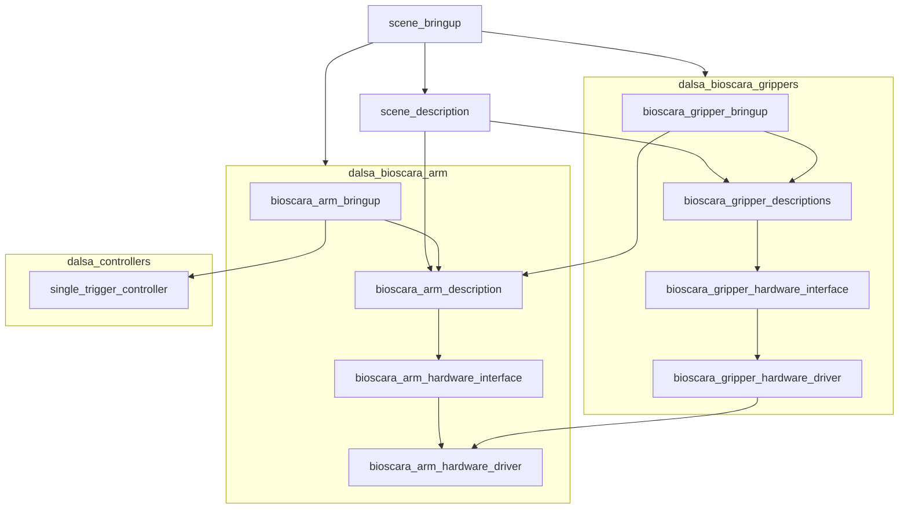

# Package Architecture
<!-- The following needs a general explaination of packages in ROS2 -->
Source code for a a software module are grouped in packages, for example a hardware interface, custom controller or robot description.

This document aims to illustrate the ROS2 package architecture as it can be found in the [~/bioscara/ROS2/ros2_scara_ws/src](~/bioscara/ROS2/ros2_scara_ws/src) directory.

- TODO: What is a package?

## Remarks on Nomenclature
- The robot arm (without any gripper) is refered to as the "arm" or "bioscara_arm".
- a custom bioscara gripper is refered to as the "gripper" or "bioscara\_gripper\_\<type\>"
- The assembly of an arm and a gripper is a "robot" or "bioscara\_\<arm\>\_\<gripper\>" .
- An environment with a robot and potentially other objects is a "scene".

## Design goals

Modularity and scalability have been a key motivation when designing the package architecture. 

Commercial robots come with their own collection of packages. 

It is expected that new iterations of a gripper are developed. Integration of those must be simplified. TODO: currently not a individual package, only indivdual macros

Modularity achieved two fold:

- standalone packages for arms and grippers.
- Grippers that are simply variants but utilize the same hardware interface, just different hardware description and hardware parameters grouped in a package but with standalone description macros.

Packages and description macros can be swapped via command line arguments or set in scene specific bringup files

The architecture may serve as a blueprint for the future integration of more DALSA robots (custom or commercial) into ROS2. 

TODO: reference to overal modularity description

## Package Types

Throughout the ROS2 workspace one can find different classes of packages whose purposes shall be described in the following.

### Meta Packages

Packages that logically belong together are grouped in meta packages. Meta packages do not contain source code or configuration files but simplify dependency management. For example a hardware meta package may contain the hardware's description, driver, interface, controller and bringup packages. Other packages that depend on that hardware can simply specify the meta package as a dependency and automatically inherit the remaining sub-dependencies. 

The following meta packages are available:

**dalsa_bioscara_arm**: Contains all packages related to the custom bioscara arm hardware component

**dalsa_bioscara_grippers**: Contains all packages related to  the custom bioscara gripper hardware component and its variants. 

**dalsa_controllers**: Contains custom, hardware agnostic controllers.

Hardware component meta packages are structured according to the [RTW Package Structure](https://rtw.b-robotized.com/master/guidelines/robot_package_structure.html) refrence, developed by [dstogl](https://github.com/destogl), a key developer of ros2_control.

<!-- TODO: order of packages. Bringup needs explaination of description first -->

Bringup parses scene description from description package and starts control stack with controller parameters and hardware components

#### Description Packages
A robot description file is an integral part in many ROS2 applications. ROS2 uses an XML based format called Unified Robot Description File (URDF) which is "*a format to describe the kinematics, dynamics, and geometries of robots, independently of software program*" [[1]][urdf], in detail this includes a systems:

- Kinematic description (joints and frame definitions) TODO: Frames and joint graph (vs DH definitions)
- Visual properties for viszualization
- Collision properties defining physical boundaries for trajectory generation
- Mass and Inertial properties for physical simulation (not utilized in this project)
- The urdf can be expanded for specific applications, in this project it addtionally includes:
- ros2_contol configuration
  - interfaces
  - joints
  - hardware interface plugin

[urdf]: https://vbn.aau.dk/ws/files/710175796/main.pdf	"Understanding URDF: A Dataset and Analysis"

Hardware components have a description package that describe the hardwares kinematic chains (joints and frames), collision 
Description packages contains a scene for standalone bringup, and if hardware component a hardware component macro that can be included in other description files to assemble a system. Each component macro loads the components hardware interface and visual, collision and kinematic description. (TODO: explain urdf, xacro, xacro macros)

- Contains a view launch to simply display the geometry visuals and collision bodies, test joint limits using joint state broadcaster and frame transformations.

  <!-- TODO: explain robot assembly -->

Key feature is to dynamicaly assemble description files via xacro to assemble robot condifurations.  

#### Bringup Packages

- Launch files to start the unit with the entire application stack which can run standalone
  ....

- 

#### Hardware Interface Packages

#### Hardware Driver Packages

Consists of:

**urdf**

**meshes**

**launch**:

config

#### Controllers Packages

- meta package for dalsa_bioscara_arm, the robot arm itself

## Overview

singletirggercontroller as standalone package outside dalsa_biosacra:

is not tied and specific to bioscara

shared namespace between joints and gripper driver for simpler code

same for hardware interface

bioscara_gripper_descriptions i splural since it can host variants of the bioscara gipper. interface stays the same only description and parameters will change

<!-- TODO -->

## Scene Bringup
One-off launch file to launch the specific hardware combination, bioscara_arm and bioscara_gripper_128 in this case. 

would be nice if it could be a single launch file but. Each each setup is slightly different.