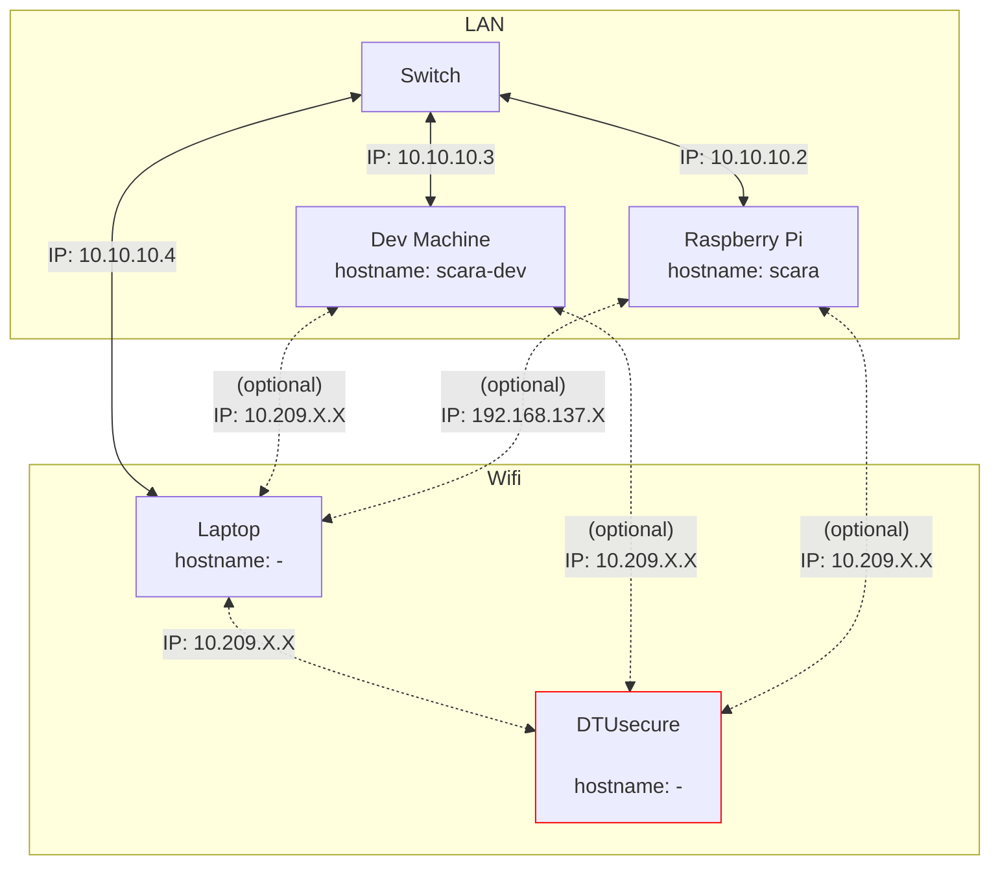

## Setup on the Raspberry Pi
> [!CAUTION]
>
> This list is under development and not complete (yet)

- Install Ubuntu Server 24.04 LTS
- Install openssh-server
- Run the scripts provided in [/scripts](scripts)


## Realtime Requirements
Both of the following settings were set to the best realtime performance after the installation of Ubuntu Server 24.04 LTS on the Raspberry Pi. This is how to check and change them if necessary.

This set of kernel configuration is also set when installing the "Low Latency Ubuntu" (`sudo apt install linux-lowlatency`)

### Preemption Policy 

In mainline Ubuntu the maximum preemption policy is PREEMPT. Check if set using:
Check if enabled if CONFIG_PREEMPT is set:
```bash
cat /boot/<BUILD?> | grep CONFIG_PREEMPT
```
last \<BUILD\> = config-6.8.0-1028-raspi

> PREEMPT_VOLUNTARY: This config option adds preemption points to the kernel, enabling voluntary interrupts of low-priority processes. By providing faster application responses with only slightly reduced throughput, CONFIG_PREEMPT_VOLUNTARY suits desktop environments.
>
> PREEMPT: Enabling CONFIG_PREEMPT reduces the kernel latency by making low-priority processes involuntarily preempt themselves. Preemption is disabled only at critical locations where the kernel must protect data from concurrency. Such config option fits embedded applications with latency requirements in the order of milliseconds. [source](https://ubuntu.com/blog/industrial-embedded-systems-ii)

### Interrupt Timer Resolution
> The timer interrupt handler interrupts the kernel at a rate set by the HZ constant. The frequency affects the timer resolutions as a 100 Hz value for the timer granularity will yield a max resolution of 10ms (1 Hz equating to 1000ms), 250Hz will result in 4ms, and 1000Hz in the best-case resolution of 1ms. [source](https://ubuntu.com/blog/industrial-embedded-systems-ii)

```bash
cat /boot/<BUILD?> | grep CONFIG_HZ
```
last \<BUILD\> = config-6.8.0-1028-raspi

### Adding the scara user to realtime group
Add the user to the realtime group and give it the rights to set higher scheduler priotities as described [here](https://control.ros.org/jazzy/doc/ros2_control/controller_manager/doc/userdoc.html#determinism)

| For real-time tasks, a priority range of 0 to 99 is expected, with higher numbers indicating higher priority. By default, users do not have permission to set such high priorities. To give the user such permissions, add a group named realtime and add the user controlling your robot to this group:

```bash
sudo addgroup realtime
sudo usermod -a -G realtime $(whoami)
```
| Afterwards, add the following limits to the realtime group in /etc/security/limits.conf:
```
@realtime soft rtprio 99
@realtime soft priority 99
@realtime soft memlock unlimited
@realtime hard rtprio 99
@realtime hard priority 99
@realtime hard memlock unlimited
```
| The limits will be applied after you log out and in again.


## Network Configuration
The network architecure is as follows:


### Assign a static IP
create the */etc/netplan/99_config.yaml* file with following content:
```yaml
network:
  version: 2
  renderer: NetworkManager
  ethernets:
    eth0:
      addresses:
        - 10.10.10.2/24
      routes:
        - to: default
          via: 10.10.10.1
          metric: 700 # Increase the metric so that a the wifi connection (metric: 600) is prefered for internet traffic
      nameservers:
          addresses:
            - 8.8.8.8
            - 8.8.4.4
```

to apply the changes execute:
```bash
sudo netplan apply
```
### Create a static hostname entry
in the */etc/hosts* add the following line:
```
10.10.10.2 scara-scara
```

## Development Purposes:
### Install [PlotJuggler](https://github.com/facontidavide/PlotJuggler)
A very powerfull to to display data
```bash
sudo apt install ros-$ROS_DISTRO-plotjuggler-ros
```

### Install RQT tools
```bash
sudo apt install ros-humble-rqt*
```

### For debugging
```bash
sudo apt install xterm gdb gdbserver
```