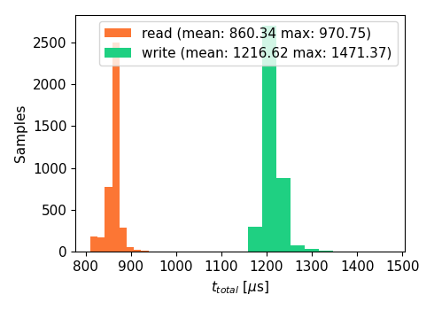
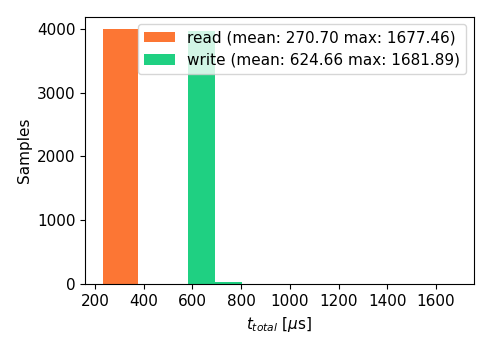
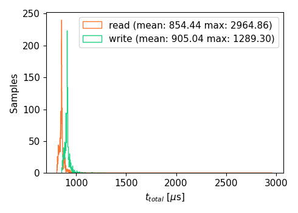
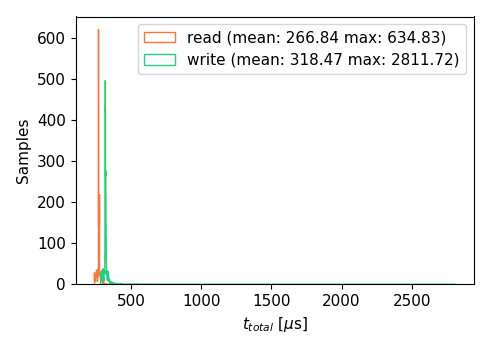
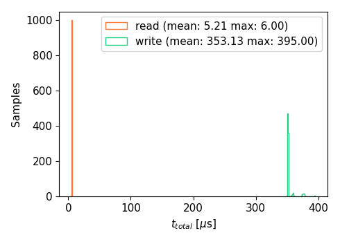
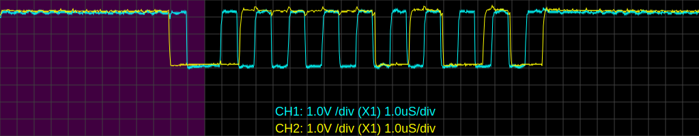
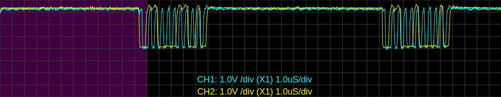

# Communication Read/Write speed test
The realtime performance tests described in the [realtime test](../RT_test/README.md) showed slow execution times for both the read and write cycle. To be precise the test measured the following average cumulative execution times for all joints:
- **Read** (*getPosition*): 3575 μs
- **Write** (*setPosition*): 5062 μs

> [!NOTE]
>
> When conducting the realtime test the position joint trajectory controller was used. In the latest iteration the velocity joint trajectory controller is used. 

This test is to identify the bottleneck that causes the long execution times and to investigate if they can be increase to enable higher controller update rates.

## Description
The test consists of two units:
### Joint Firmware
<!-- TODO: describe and link how to flash firmware  -->
A firmware variant ([profiling_test.ino](../../lib/joint_firmware/profiling_test/profiling_test.ino)) is flashed on the joint controller. This firmware times the execution of the `non_blocking_handler()` which handles the incoming commands and prints the results to the serial port in CSV format. The development machine stays connected to the joint via USB to capture the serial port output and save it to a file. The [Realterm](https://sourceforge.net/projects/realterm/) software was used to cpature and save the serial output. 
### Controller
<!-- TODO: describe and link how to build and source workspace  -->
The controller executes the system_test_packages/comm_speed_test program
```bash
cd ~/bioscara/lib/ros2_ws
ros2 run comm_speed_test main
```

<!-- TODO: write documentation for test program, link or reference here -->
The test program calls times the read and write execution of either position or velocity (`getPosition()`/getVelocity/() and `setPosition()`/setVelocity/() respectively) for a total of 1000x cycles per joint and prints the collected data to a CSV file.

No prints and other unneccessary functions are executed in the timed sections.

## Background
### I2C Protocol
The robot controller and joints communicat via an I2C bus. [This](https://www.ti.com/lit/an/slva704/slva704.pdf) document describes the protocol in detail, below the transmitted bytes are summarized in Table 1 below. Counting the number of transmitted bits is important since the I2C bus clock runs at a speed of 100 kHz (100 kbit/s) or 400 kHz (400 kbit/s).


|Sender|      |         |       |      |        |      |        |      |      |        |      |      |         |       |      |        |      |      |        |       | | Bits                 |
| ---- | ---- | ------- | ----- | ---- | ------ | ---- | ------ | ---- | ---- | ------ | ---- | ---- | ------- | ----- | ---- | ------ | ---- | ---- | ------ | ----- | ---- | ---------------- |
|*Controller* | S[1] | Addr[7] | Re[1] |      | Reg[8] |      | TX*1*[8] |      | ...  | TX*m*[8] |      | S[1] | Addr[7] | Re[1] |      |        | A[1] | ...  |        | NA[1] | P[1] | 27+*n*+8\**m*       |
|*Target* |     |         |       | A[1] |        | A[1] |        | A[1] | ...  |        | A[1] |      |         |       | A[1] | RX*1*[8] |      | ...  | RX*n*[8] |       |      | 3+8\**n*+*m*       |
|      |     |         |       |      |        |      |        |      |      |        |      |      |         |       |      |        |      |      |        |       |      | **30+9\**n*+9\**m*** |

**Table 1:** I2C transmission frames for a combined Read/Write. The number in [n] brackets are the number *n* of transmitted bits in this frame.

> [!NOTE]
>
> The sum of bits in Table 1 is only true for combined Read/Write transmission. In this application every transmission is a Read/Write transmission since at a minimum the return flags are always read from the joint. For a single write transmission with *m* transmitted bytes, the total number of transmitted bits is slightly different (repeated start and repeated address are ommited) and given as follows: *Controller* sends: 18+8\**m* bits, *Target* sends: 2+*m* bits, in **total:** 20+9\**m* bits are transmitted.

### Transmission Speed for set/get Position/Velocity
For the transmissions (get/set Position/Velocity) in questions float values of 4 byte size are transmitted:
|      |Write Bytes *m*|Read Bytes *n*| Total Bytes | Total Bits |
| ---- | ----: | ----: | ----: |  ----: | 
|`setPosition()`/`setVelocity()`| target [float]  4   | flags [uint8_t]  1   | 5 | 75 |
|`getPosition()`/`getVelocity()`|   0   |  value [float] + flags [uint8_t] 4 + 1   | 5 | 75 |

**Table 2:** Number of bytes and bits transmitted per function.

At the '*Standard Mode*' speed of 100 kbit/s the transmission of 75 bits takes then: **$t_{trans}$ = 750 μs** <br>
At the '*Fast Mode*' speed of 400 kbit/s the transmission of 75 bits takes then: **$t_{trans}$ = 187.5 μs**

## Total Execution time
The total execution time $t_{total}$ which was measured in the realtime-test is the sum of of the following contributions:
- Transmission $t_{trans}$: The formerly calculated theoretical tranmission time via I2C.
- Firmware execution time $t_{exec}$: The duration between receiving the command on the firmware, processing it in the `non_blocking_handler()` returning the state flags.
- Overhead $t_{oh}$: Similar to $t_{exec}$, program overhead, for example memory allocation or similar.
- Noise $t_{noise}$: Delays outside the programs control, for example preemptions.

$$
t_{total} = t_{trans} + t_{exec} + t_{oh} +t_{noise}
$$

## Tests
A series of individual tests have been conducted to gather the relevant data to determine the contributing factors described in the previous section.
- set/getPosition at 100 kHz
    - File: *[position_100khz.csv](position_100kHz.csv)*
- set/getPosition at 400 kHz
    - File: *[position_400khz.csv](position_400kHz.csv)*
- set/getVelocity at 100 kHz
    - File: *[velocity_100khz.csv](velocity_100kHz.csv)*
- set/getVelocity at 400 kHz
    - File: *[velocity_400khz.csv](velocity_400kHz.csv)*
- set/getPosition at 400 kHz, execution time on firmware.
    - File: *[baseline_joint_400khz.csv](baseline_joint_400kHz.csv)*

Addtionally the I2C waveform on the SDA and SCL line has been measured with an oscilloscope to judge if the Raspberry Pi 4 is capable of driving the bus with the given cable length at 400 kHz.
## Results
### Total Time
<table>
  <tr>
    <td><center><strong>Figure 1(a):</strong> Histogram of total time of get/setPosition() at 100 kHz</td>
    <td><center><strong>Figure 1(b):</strong> Histogram of total time of get/setPosition() at 400 kHz</td>
  </tr>
   <tr>
    <td><center><strong>Figure 1(c):</strong> Histogram of total time of get/setVelocity() at 100 kHz</td>
    <td><center><strong>Figure 1(d):</strong> Histogram of total time of get/setVelocity() at 400 kHz</td>
  </tr>
</table>

<br> 

The results are summarized in Table 3 below:
| Speed Mode [kHz] |Function   | Mean [μs] | Max [μs]    |
| ---- | ---- | ----: | ----: |
|100|`getPosition()`|860.34 | 970.75|
||`setPosition()`| 1216.62|1471.37|
||`getVelocity()`| 854.44 | 2964.86|
||`setVelocity()`| 905.04|2964.86|
|  |  |  |  |
|400|               `getPosition()`| 270.70 | 1677.46|
||            `setPosition()`   | 624.66|1681.89|
||            `getVelocity()`   | 266.84 | 634.83|
||            `setVelocity()`   | 318.47|2811.72|

**Table 3:** Mean and Max total time $t_{total}$ at different transmission speeds and for velocity and position

There is an interesting feature: The `setPosition()` method takes significantly longer than all other functions at a given speed. Furthermore the difference between mean total time for `setPosition()` and `getPosition()` at 100 kHz and 400 kHz is 357 μs and 354 μs respectively, basically identical regardless of the transmission speed. All other functions are somewhat equally fast at their repective transmission speed.


### Execution Time on Firmware
The test was conducted at 400 kHz, however this has no effect since the test only times the execution time between transmission parts.



**Figure 2:** Histogram of the execution time of the position set and get method on the firmware.

This test clearly shows the reason for the much longer $t_{total}$ for `setPosition()`: The corresponding function on the joint firmware itself takes on average $t_{exec}$ = 351.13 μs, while the corresponding function to `getPosition()` only takes  $t_{exec}$ = 5.21 μs on average. exactly the difference previously described. The execution on the joint takes hence 345.92 μs longer on the joint, very close the discrepancy in $t_{total}$.

There is no data for the $t_{exec}$ for `setVelocity()` and  `getVelocity()`, however from the total time it can be deduced that the execution time is similar to $t_{exec}$ for `getPosition()`, since they are relatively close.

this leaves finally the calculation of overhead and noise:<br>
$$
t_{oh} + t_{noise}  = t_{total} - t_{exec} - t_{trans} 
$$

|Speed |Methods|$t_{oh} + t_{noise}$ [μs]|
|---|---|---:|
|100|`getPosition()`|105|
||`setPosition()`|113|
||||
|400|`getPosition()`|84|
||`setPosition()`|78|

**Table 4:** Noise and overhead calculation results.

Table 4 shows that the calculated noise and overhead are only to little degree dependent on transmission speed, and remain somewhat constant. This is expected for the software overhead.


### I2C Waveform
The Inter-Integrated-Circuit (I2C) protocol was as the name suggest never designed to communicate over long distances, however in this applications the wire length accumulates to around 4 m. The long cable length introduces a large capacitance which has to be driven by the Raspberry Pis 1.8 kΩ pul-up resistors. The faster the I2C speed the faster the charge has to be removed and applied, if the capacitance is too large the waveform will become distorted, and in the worst case when the bit value is read, it has not yet reached the HIGH or LOW value.

The oscilloscope screen captures show that the waveform at 400 kHz already looks distorted but crucially the SDA seems to reach the HIGH/LOW state when the SCL signal becomes high. It is at this point the bit is sampled as 0 or 1. From this analysis it is concluded that the I2C bus could be driven at 400 kHz.

<table>
  <tr>
    <td><center><strong>Figure 3(a):</strong> Waveform of SCL (blue) and SDA (yellow) of the I2C bus 100 kHz</td>
  </tr>
   <tr>
    <td><center><strong>Figure 3(b):</strong> Waveform of SCL (blue) and SDA (yellow) of the I2C bus 400 kHz</td>
  </tr>
</table>

There are two limitations: 
- The oscilloscope has a too low sampling frequency to judge the 400 kHz waveform correctly
- The potential result driving the bus at 400 kHz could be a bit flip, which could would go unchecked since to checksum is implemented in the communication protocol to save bytes. A bit flip could have destructive results.

## Discussion
This test has been conducted to investigate if it is possible to increase the controller frequency to achieve better performance and to determine if velocity control is feasible.

### Velocity based Control
This controller relies on a closed loop feedback and calculates joint velocity commands through a PID loop. This has the advantage that it eliminates tracking error for ramp inputs. See the [tracking_error test](../tracking_error/README.md). For this reason the velocity controller is preferential, but it requires a higher controller frequency for a given joint speed to be able timely compute new velocity commands.

The controller needs to:
- Read:
  - Joint velocity
  - Joint position
- Write:
  - Joint velocity

| Method            | $t_{total}$ (100 kHz) [μs]| $t_{total}$ (400 kHz) [μs]|
| ---               |---:   |---:   |
|`setVelocity()`        | 905  |319  |
|`getVelocity()`        | 853  |267  |
|`getPosition()`        | 860  | 625  |
| per joint *subtotal*        | 2,618  |1,211  |
| 4 joint **total** | 10,472 | 4,844  |

**Table 5:** Expected total times for the velocity based controller.


### Velocity based Control
The simplest joint controller simply forwards position commands to the hardware. The controller is non as such since there is no feedback loop. This drastically lightens the requirements on the robot controllers realtime capability and controllers update frequency. However it leaves all the closed loop control to the joint firmware which has a much less advanced internal control loop. This results in a steady state tracking error for a ramp position reference.

The controller needs to:
- Read:
  - Joint position
- Write:
  - Joint position

| Method            | $t_{total}$ (100 kHz) [μs]| $t_{total}$ (400 kHz) [μs]|
| ---               |---:   |---:   |
|`setPosition()`        |  1,217  |625  |
|`getPosition()`        | 860  | 271  |
| per joint *subtotal*        |2,077|896|
| 4 joint **total** |8,308|3,584|

**Table 6:** Expected total times for the position based controller.

### Scheduler Priority
The comm_speed_test program is run without realtime priorities and hence can be subject to preemption of higher priority threads. This will have an impact on worst case execution times but over 1000 samples the impact will be reduced. For this reason the max values have not been taken into consideration. It is assumed that they will be drastically reduced when running with a realtime priority, which the ros2_control node is.

### Final Discussion on I2C Bus speed
Although it is possible to run at 400 kHz I2C bus speed, long term reliability tests are still outstanding to proove that no communication errors occur. For now the I2C speed remains at the much more robust 100 kHz.
