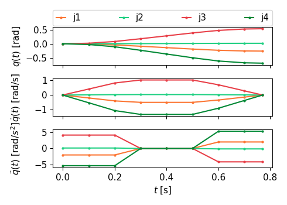

# Comparing Trajectory generation for Point-To-Point Motion between Pilz and OMPL Motion Planner
A test to compare PTP trajectories absent of external constraints between the Pilz Industrial Motion Planner and the OMPL planner.
## Background
The Pilz Industrial Motion Planner (PILZ planner) introduces the new Action/Service *MoveGroupSequenceAction*/*MoveGroupSequenceService*, which allows to concatenate multiple trajectories with an optional blend radius. See the [documentation](https://github.com/moveit/moveit2_tutorials/blob/b0ba2a971d18a024d136ec7b175c7353eb0e02d8/doc/how_to_guides/pilz_industrial_motion_planner/pilz_industrial_motion_planner.rst#sequence-of-multiple-segments) for more details.

The motion sequence is created by individual trajectories for each passed waypoint and subsequently blending them together. Being part of the PILZ planning pipeline the motion sequence has been designed for the use with the one of the PILZ motion planners (planner_id: "LIN","CIRC", and "PTP") in mind. Besides the *planner_id*, the planning request of type *MotionPlanRequest* however also allows, to set the *pipeline_id*. By setting the *pipeline_id* to 'ompl' (the exact name depends on the name the planning pipeline has been given when passed to the move_group on launch) the OMPL motion planner can be invoked to create a sequence segment.

## Problem
The problem arises when the trajectories are being blended. To blend two trajectories ([See how](https://github.com/moveit/moveit2/blob/760277f74ba78bc48f157f7f6c38ac13de4a2721/moveit_planners/pilz_industrial_motion_planner/doc/MotionBlendAlgorithmDescription.pdf)) the first trajectory's last point and second trajectory's first point must have equal position, and zero velocity and acceleration. The PILZ planners create such trajectories, OMPL however do not and hence [this](https://github.com/moveit/moveit2/blob/760277f74ba78bc48f157f7f6c38ac13de4a2721/moveit_planners/pilz_industrial_motion_planner/src/trajectory_blender_transition_window.cpp#L177) fails. Inhibiting the sequence blender to complete successfully. The trajectory created by OMPL however is a trapezoidal trajectory (absent of other constraints like collisions) and hence SHOULD have zero acceleration at the start and end.

<!-- TODO: write pros and cons of PILZ vs OMPL -->
## Test
To investigate why the blending fails a simple test is conducted. The robot hardware is launch (mock_hardware is sufficient), the move_group and Rviz with the MotionPlanning panel is started. Using the MotionPlanning a new goal position (relatively close to the starting position to avoid long trajectories) is created and a planning request is sent. First to the OMPL and secondly the the PILZ PTP planner. The planners respond with a created trajectory which is logged and plotted using the [plotting script](../traj_plots/README.md).

## Results
The resulting trajectories as created by the planners are plotted below. 
<table>
  <tr>
    <td>
<strong>Figure 1(a):</strong> Trajectory created by the PILZ PTP planner</td>
    <td>
<strong>Figure 1(b):</strong> Trajectory created by the OMPL default planner</td>
  </tr>
</table>

There are two striking differences:
1) For the same acceleration and velocity limits the OMPL planner produces a trajectory that takes 0.77 s, while the PILZ PTP trajectory takes 1.88 s.
2) The PILZ trajectory has $\ddot{q} = 0.0$ acceleration at $t = t_0 = 0.0$ s and $t=t_f= 1.88$ s, while the OMPL trajectory has $\ddot{q} \ne 0.0$ acceleration at $t = t_0 = 0.0$ s and $t=t_f= 0.77$ s.

## Discussion
The observation described in (2) is the direct cause for the failing trajectory blend.

The significant execution duration can be attributed to the fact that the PILZ motion planner is choosing a very conservative/non-optimal approach to calculate the trapezoidal trajectory using the strictest [joint limits](https://github.com/moveit/moveit2_tutorials/blob/b0ba2a971d18a024d136ec7b175c7353eb0e02d8/doc/how_to_guides/pilz_industrial_motion_planner/pilz_industrial_motion_planner.rst#joint-limits). This approach guarantees that no kinematic limits are violated, however does so suboptimally, since the existence of a faster trajectory (the OMPL one) satisfying the same joint limits disproves optimality. This suboptimality, combined with the lacking collision avoidance when using the PILZ PTP planner is a key reason the attempt to create a motion sequence with an alternative planner has been undertaken. Ideally it is possible to leverage the convenient blended sequence with the more advanced OMPL planner.

<!-- TODO: write detailed description of PTP joint limit problem -->
<!-- TODO: Write thoughts on sequence generation. User defined tought waypoints vs collision constrained "pure" OMPL sequence with MTC f.x -->